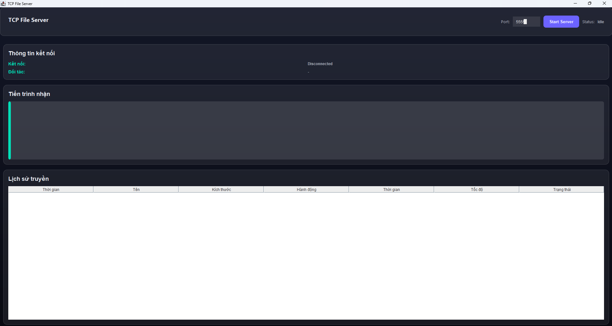
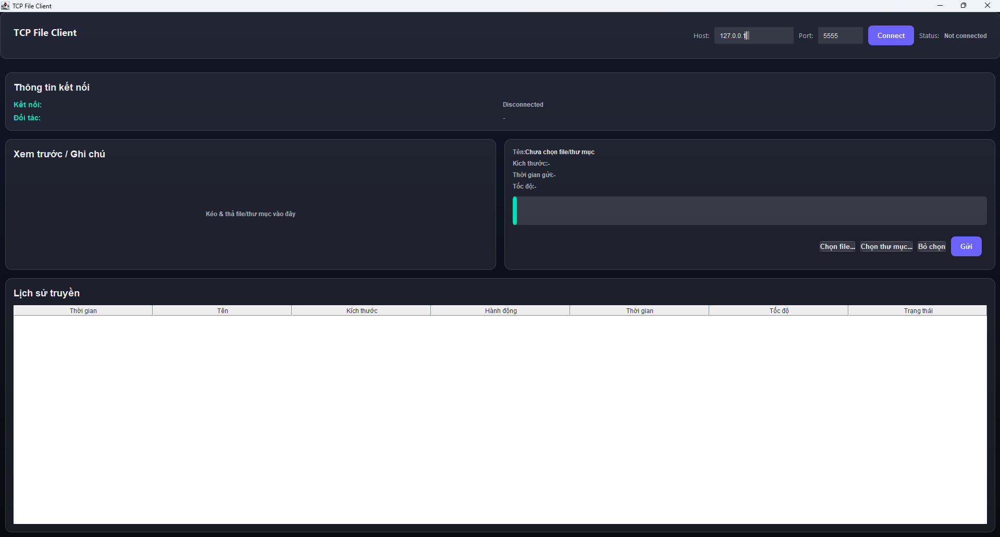
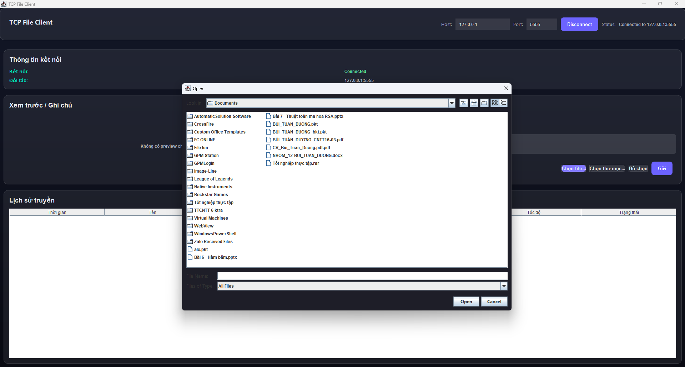
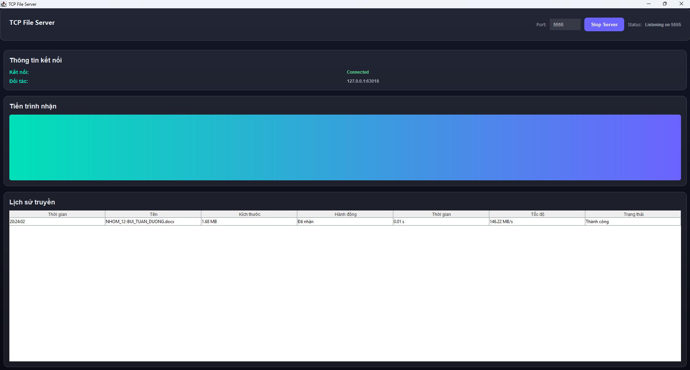

<h2 align="center">
  <a href="https://dainam.edu.vn/vi/khoa-cong-nghe-thong-tin">
    🎓 Faculty of Information Technology (DaiNam University)
  </a>
</h2>

<h2 align="center">TRUYỀN FILE TCP</h2>

  

    
    
    
  

  
  
  

---

## 📖 1) Giới thiệu
Ứng dụng **Chat & Truyền File Client–Server** viết bằng **Java** trên giao thức **TCP**.  
Cho phép **nhiều client** trò chuyện thời gian thực, chia sẻ tệp qua server trung gian; nhật ký (log) được lưu vào file văn bản để triển khai đơn giản.

- **Server**: Quản lý kết nối đa luồng, phân phối tin nhắn/ file, ghi log, xử lý ngắt.
- **Client**: Giao diện **Java Swing** để chat, gửi/nhận file, hiển thị trạng thái kết nối.
- **Lưu trữ**: Lịch sử chat/log theo thời gian (`LocalDateTime`) trên phía server.

---

## ⚙️ 2) Chức năng chính

### 🖥️ Server
- Nhận/kết thúc kết nối client (đa luồng).
- Phân phối tin nhắn & tệp giữa các client (broadcast).
- Ghi log (append) theo timestamp.
- Lệnh dọn log và dừng server an toàn.
- Hiển thị trạng thái từng client.

### 💻 Client
- Kết nối bằng **IP + Port**.
- Gửi/nhận **tin nhắn**.
- Gửi/nhận **file** (progress, tên tệp, dung lượng).
- Hộp thoại xác nhận **nhận file**.
- Thông báo lỗi & tình trạng mất kết nối.

### 🌐 Hệ thống
- **TCP Socket** (`ServerSocket`/`Socket`), **IO** buffer, try-with-resources an toàn.
- **Protocol đơn giản** (header + payload) để phân biệt message vs file.
- **Xử lý lỗi** rõ ràng phía client & log phía server.

---

## 🛠️ 3) Công nghệ
- Java 8+ (khuyến nghị 17/21)
- Java Swing (GUI)
- Multithreading
- Java Sockets (TCP/IP)
- File I/O

---

## 🖼️ 4) Hình ảnh
- Giao diện Server  
  

  
<i>Hình 1</i>

- Giao diện Client  
  

  
<i>Hình 2</i>

- Client gửi file  
  

  
<i>Hình 3</i>

- Server nhận file  
  

  
<i>Hình 4</i>

---

## 📦 5) Cấu trúc thư mục gợi ý

### 📂 Cấu trúc thư mục
📦 TCP-File-Chat
├── 📂 src
│   ├── 📂 client
│   │   ├── ClientMain.java        # Điểm vào client
│   │   ├── ChatWindow.java        # Giao diện chat
│   │   ├── FileSender.java        # Xử lý gửi file
│   │   ├── FileReceiver.java      # Xử lý nhận file
│   │   └── ClientAdapter.java     # Kết nối UI ↔ Socket
│   │
│   ├── 📂 server
│   │   ├── ServerMain.java        # Điểm vào server
│   │   ├── ServerWindow.java      # Giao diện server
│   │   ├── ClientHandler.java     # Xử lý client đa luồng
│   │   └── ServerLogger.java      # Ghi log & quản lý lịch sử
│   │
│   └── 📂 common
│       └── Protocol.java          # Định nghĩa gói tin, hằng số
│
├── 📂 docs
│   ├── aiotlab_logo.png
│   ├── fitdnu_logo.png
│   ├── dnu_logo.png
│   └── (ảnh minh họa giao diện)
│
├── 📂 scripts
│   ├── build.sh
│   ├── run_server.sh
│   ├── run_client.sh
│   ├── build.bat
│   ├── run_server.bat
│   └── run_client.bat
│
├── .gitignore
├── README.md
└── LICENSE

---
## 🚀 6) Cài đặt & Chạy

### 6.1. Yêu cầu
- **JDK 8+** (khuyến nghị JDK 17/21)
- IDE (Eclipse/IntelliJ/VS Code + Extension Java) hoặc dòng lệnh.

### 6.2. Clone nguồn

git clone https://github.com/<your-username>/<your-repo>.git
cd <your-repo>

### 6.3. Chạy bằng IDE
Import project (Java Project).

Chạy Server trước: server.ServerMain

Cấu hình IP/Port hiển thị trên server (mặc định 0.0.0.0:5555).

Chạy Client: client.ClientMain

Nhập Server IP (ví dụ 127.0.0.1 nếu cùng máy) và Port (ví dụ 5555) → Connect.

### 6.4. Chạy bằng dòng lệnh
bash
Sao chép mã
# Từ thư mục gốc
javac -d out src/server/*.java src/client/*.java
# Server
java -cp out server.ServerMain 5555
# Client (kết nối tới 127.0.0.1:5555)
java -cp out client.ClientMain 127.0.0.1 5555
### 6.5. Gửi/nhận file
Client bấm 📎 Send File → chọn tệp → thấy progress.

Bên nhận sẽ hiện hộp thoại Chấp nhận → chọn Accept để lưu, Decline để hủy.

### 6.6. Lỗi thường gặp & Cách xử lý
Connection refused: Server chưa chạy/Port sai → chạy server & kiểm tra port.

Address already in use: Cổng đã bị chiếm → đổi port (vd 5556) hoặc kill tiến trình cũ.

Firewall chặn: Cho phép Java/port qua tường lửa.

Khác mạng LAN: Dùng IP thật của server (ipconfig) và mở port trên router nếu cần.

---

## 🧩 7) Protocol đơn giản
Dòng header: TYPE|FILENAME|SIZE|SENDER|TIMESTAMP\n

TYPE = MSG | FILE_OFFER | FILE_DATA | FILE_DECLINE

Với MSG: payload là text UTF-8.

Với FILE_OFFER: client nhận hỏi Accept/Decline.

FILE_DATA: gửi đúng SIZE byte.

FILE_DECLINE: server thông báo cho người gửi.

---

## 🧪 8) Các dự án (mở rộng)
Project 1: Truyền file TCP cơ bản (1–1).

Project 2: Ứng dụng chat TCP đa luồng (broadcast, xác nhận nhận file).

Project 3: Quản lý truyền tải trong LAN (chọn người nhận, nhật ký chi tiết, resume).

---

## 👤 Liên hệ
Họ tên: Bùi Tuấn Dương

Lớp: CNTT 16-03

Email: buibanh2k4@gmail.com

© 2025 AIoTLab, Faculty of Information Technology, DaiNam University. All rights reserved.